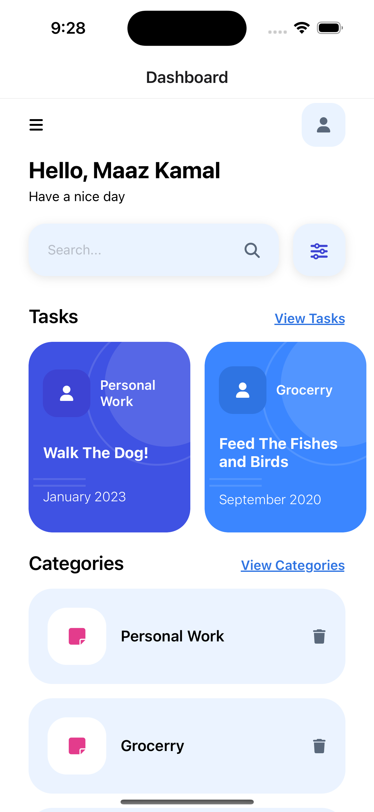
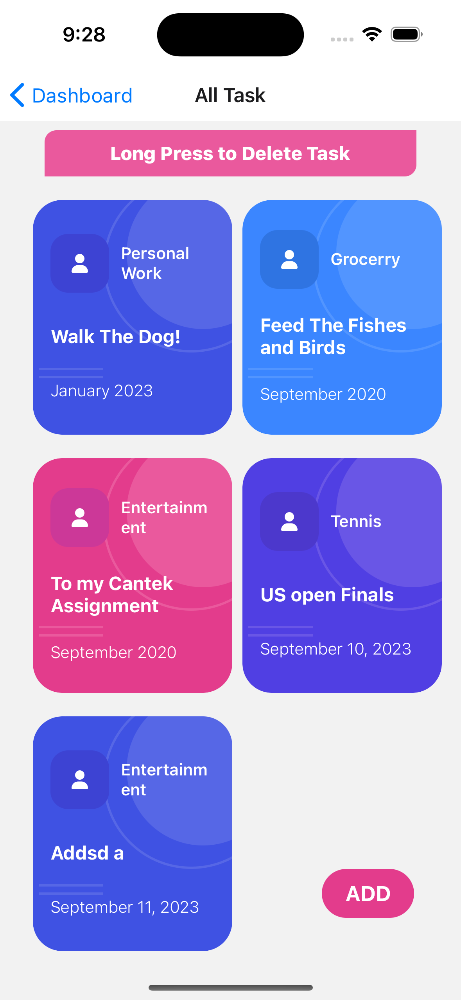
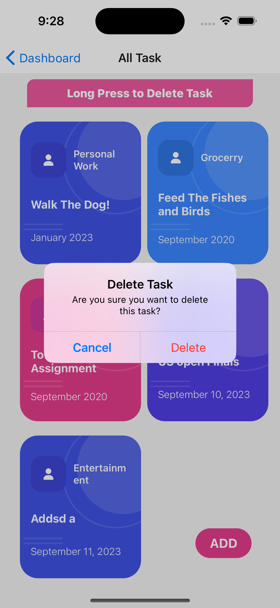
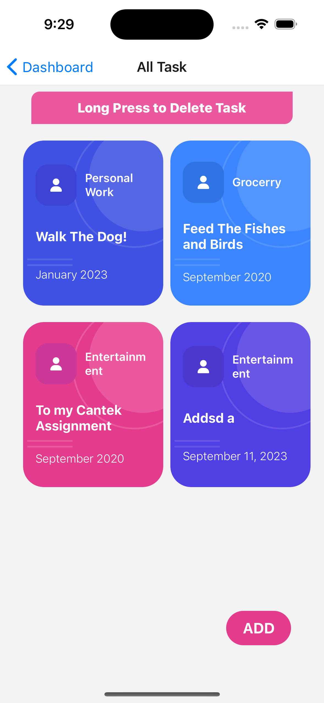
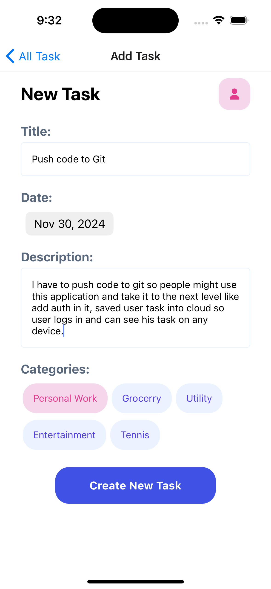
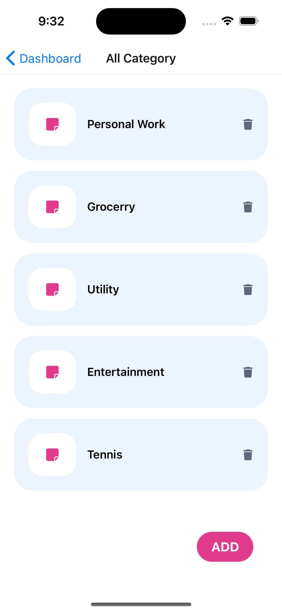
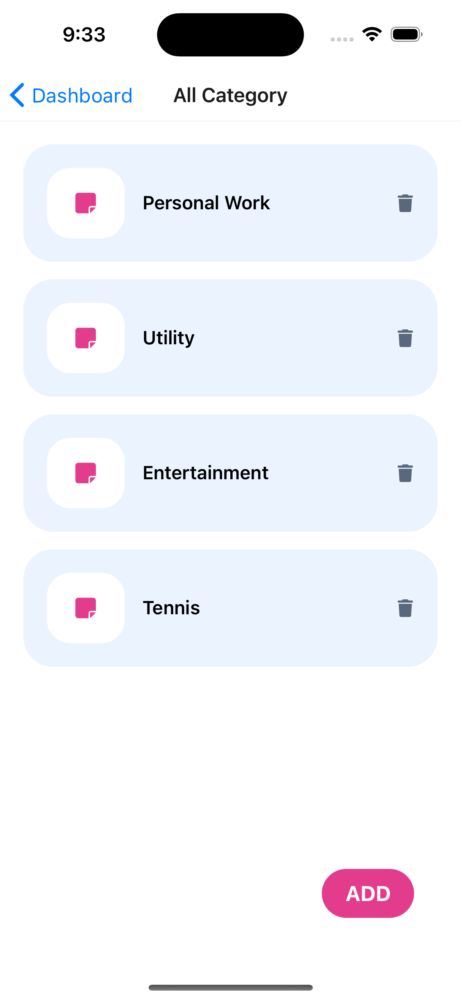
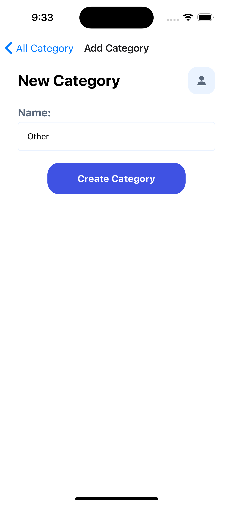
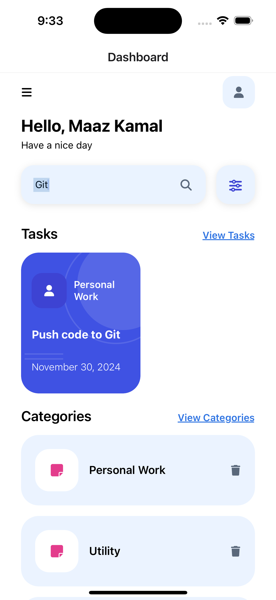

 

# MiniTasker

> Streamline your tasks effortlessly with our Minitasker. Organize, categorize, and manage your to-dos with ease.
> Made with ❤ on React Native.

  
  
  
  

<!-- Hello -->

